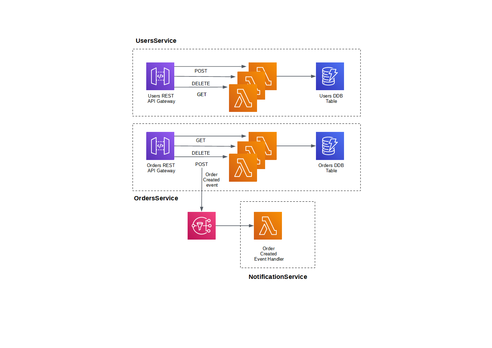

# ninja order service

This is a ninja ordering service implemented with AWS Serverless.

## System Design

The system design is straightforward. The design for the OrdersService and UsersService are identical. Each service's functionaltity is exposed as REST APIs: POST, GET, and DELETE verbs for Create, Retrieve, and Delete actions respectively on entities. Each service is backed with a Dyanamo DB table.

The NotificationService sends notifications to users in response to events published via SNS. At present, the notification follows an OrderCreated event. NotificationService consists simply of lambda functions that respond to events. For example, the OrderCreated notification code can be extended to notify end-users through their preferred channel e.g. mobile, sms, etc.

### On Scalability
The system is as scalable, in terms of spikes and drops in traffic, as Lambda functions, that being the only compute resource used. However, the limits of Lambda also apply, especially memory and execution duration. For example, these limits constrain the complexity of the ordering processes i.e. the processes cannot take longer than lambda's 15 minutes limit of execution. A simple solution would be to implement complex and long-running workflows using StepFunctions.

API Gateway is deployed as multi-AZ per region by default. The default VPC spans three AZ subnets. Further development of the system may isolate each service into its own VPCs/subnets, in which case the VPCs need to be designed carefully to maintain the availability of the API Gateways.

If further availability of a service is desired, its API Gateway may be deployed across multiple regions. This would require its backing databases to be synced across multiple regions e.g. DynamoDB's Global Tables.

### On Resiliency
The API Gateway throttles requests to the services. This prevents the services from being overloaded. Still, considering that it is serverless components in use, the design is quite resilient to external fluctuations, albeit expensive.

Although not configured here, it would be straightforward to schedule the periodic backup of the DynamoDBs.

## Running the code
### Prerequisites
1. Python 3.11
2. poetry
3. docker
4. AWS CLI v2

### Deployment
1. Clone repo
2. Run `poetry shell` to create and initiate your virtual environment
3. Run `aws sso login`
4. Run `make deploy` to deploy to AWS

### To run Integration tests separately
1. Change `tests/integration/conftest.py` `AWS_DEFAULT_REGION` if not running from `ap-southeast-2` (SYD)
2. Run `make integration` to run integration tests
3. OR `make e2e` to run end-to-end tests

### To deploy and run Integration and end-to-end tests
1. Run  `make pr` after running the preceeding non-make steps.

## Code Walkthrough
The code has two main parts: `cdk` and `service`. `cdk` code sets up the AWS infrastructure using CDKv2 Python code.
For simplicity the stacks of the three services are created together in `service_stack.py`. It is trivial to separate them as their component constructs are already separate in their own python files.

The `service` subdirectory contains the three services application code, which are also easily separable should the need arise. The layering of the application follows a familiar pattern of data access layer (`dal`), handling (`handlers`), and business logic (`logic`). Each layer can be switched out, and this is straightforward to do. For example, the handler logic can be swapped out from the current REST-style to handle an RPC-style API. In principle, the two styles can even co-exist. Similarly, the `dal` layer can be switched from DynamoDB to a different database without changing the other layers.

The `tests` directory testing code for the cdk and service codebase covering infrastructure, unit, integration, and end-to-end tests.
